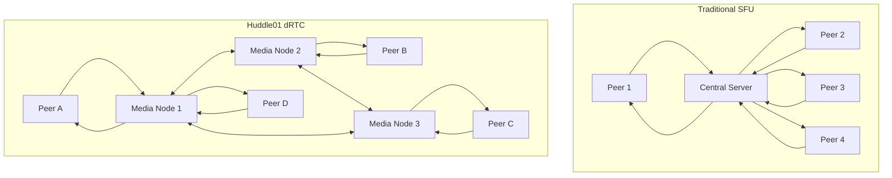
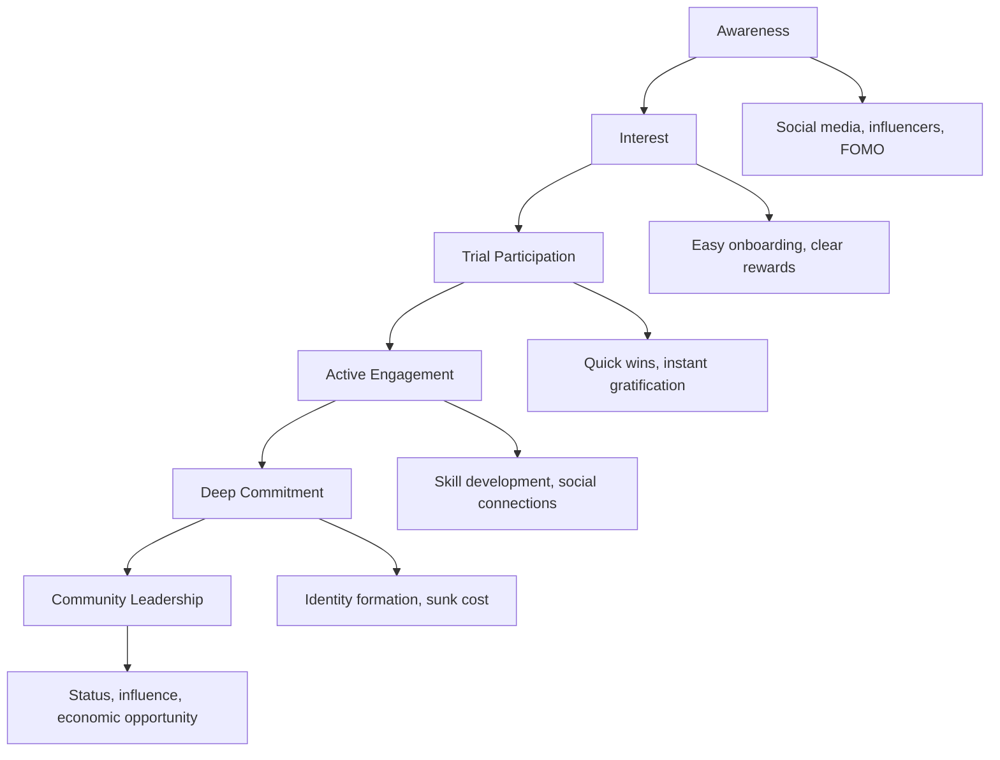

# 🧠 Glossary of Key Concepts

- **WebRTC**: Technology for real-time audio, video, and data communication directly between browsers/devices, without a central server for media relay.
- **SFU (Selective Forwarding Unit)**: A server that receives media streams from participants and forwards them to others, optimizing bandwidth and scalability.
- **Decentralization**: Distributing control and resources across many independent nodes, rather than relying on a single central authority.
- **libp2p**: A modular network stack for peer-to-peer applications, enabling discovery, secure communication, and data routing across diverse protocols.
- **Token Gating**: Restricting access to features or rooms based on ownership of specific blockchain tokens or NFTs.
- **Testnet**: A simulated blockchain environment where new features and economic models are tested without real financial risk.
- **Node**: A participant in a network that provides resources (like bandwidth or compute) and helps relay data.
- **DHT (Distributed Hash Table)**: A decentralized system for storing and retrieving key-value pairs, used for peer discovery.
- **Incentive Layer**: Mechanisms (often token-based) that reward participants for contributing resources or value to the network.

---

> **Conceptual Overview: Why Decentralized WebRTC?**
>
> Imagine a group chat where, instead of everyone sending their messages through a single post office (central server), each person can pass notes directly or through trusted friends (nodes). This makes the system more resilient—if one friend leaves, the conversation continues. Decentralized WebRTC applies this idea to video and audio, making communication more robust, censorship-resistant, and community-owned.

---

# 🚀 Complete Guide: Huddle01's Decentralized WebRTC Architecture & Implementation

---

## 🎯 Overview: Huddle01's Revolutionary Approach {#overview}

> **Conceptual Intro:**
> Traditional video calls are like everyone calling into a single radio station, which then rebroadcasts to all listeners. This works, but if the station goes down, everyone loses connection. Huddle01's approach is more like a mesh of walkie-talkies, where messages can hop through multiple people, making the system more resilient and democratic.

### The Problem with Traditional WebRTC
Traditional WebRTC has three main architectures, each with significant limitations:

| Architecture | How It Works | Limitations |
|-------------|--------------|-------------|
| **P2P (Peer-to-Peer)** | Direct connection between users | Scales poorly (n² connections), high bandwidth usage |
| **MCU (Multipoint Control Unit)** | Central server mixes all streams | Single point of failure, expensive infrastructure |
| **SFU (Selective Forwarding Unit)** | Central server forwards streams | Still centralized, vendor lock-in, censorship risk |

### Huddle01's Innovation: dRTC (Decentralized Real-Time Communication)

Huddle01 combines WebRTC with libp2p protocols to create a decentralized network where Media Nodes act as distributed SFUs, eliminating centralized infrastructure while maintaining scalability and performance.

**Key Innovations:**
- **Distributed SFUs**: Replace centralized servers with globally distributed Media Nodes
- **Economic Incentives**: Node operators earn tokens for providing bandwidth and uptime
- **Cryptographic Security**: End-to-end encryption with keys generated locally on devices
- **Censorship Resistance**: No single point of control or failure

---

## 🏗️ Deep Dive: Peer-Node-Node-Peer Architecture {#architecture}

> **Conceptual Intro:**
> Think of the network as a city with many roads (nodes) and intersections (peers). Instead of all traffic going through a single highway (central server), cars (media packets) can take multiple routes, avoiding jams and roadblocks. This flexibility is qthe core of decentralized routing.

### Traditional SFU vs Huddle01's Distributed SFU



### How Peer-Node-Node-Peer Communication Works

1. **Peer Discovery**: Using libp2p's modular network stack, peers discover available Media Nodes through the Registry Network

2. **Node Selection**: Orchestrator Network assigns optimal Media Nodes based on:
   - Geographic proximity
   - Network latency
   - Node capacity and reputation
   - Quality of Service metrics

3. **Stream Routing**: Media flows through the distributed network:
   ```
   Peer A → Media Node 1 → Media Node 2 → Peer B
   ```

4. **Dynamic Adaptation**: Network automatically adjusts routing based on:
   - Node availability
   - Network congestion
   - Quality metrics

### Network Layers Architecture

Huddle01's dRTC network consists of multiple coordinated layers:

| Layer | Purpose | Components |
|-------|---------|------------|
| **Registry Network** | Node discovery and capability advertising | DHT-based node registry, capability matching |
| **Orchestrator Network** | Intelligent routing and coordination | Room orchestration, node assignment, load balancing |
| **Media Network** | Actual data transmission | Distributed Media Nodes, WebRTC connections |
| **Incentive Layer** | Economic coordination | Smart contracts, token rewards, staking mechanisms |

---

## ⚙️ Technical Implementation Details {#implementation}

> **Why This Matters:**
> By breaking down the Media Node into modules, you can see how each part contributes to the network's health, security, and performance. It's like a car: the engine (media processing), GPS (routing), dashboard (monitoring), and keys (blockchain identity) all work together for a smooth ride.

### Media Node Architecture

Each Media Node consists of several specialized modules working together:

```typescript
interface MediaNode {
  // Core processing module
  webrtcSFU: {
    manageConnections(): void;
    routeMediaPackets(): void;
    handleEncoding(): void;
    manageDecoding(): void;
  };
  
  // Inter-node communication
  rpcModule: {
    communicateWithNodes(): void;
    coordinateWithOrchestrator(): void;
    handleInstructions(): void;
  };
  
  // Quality and monitoring
  qosModule: {
    advertiseCapabilities(): void;
    monitorResources(): void;
    ensureServiceQuality(): void;
    reportMetrics(): void;
  };
  
  // Public API interface
  apiModule: {
    exposeHealthMetrics(): void;
    provideBandwidthStats(): void;
    shareGeolocation(): void;
    reportUsage(): void;
  };
  
  // Blockchain integration
  evmWallet: {
    manageIdentity(): void;
    handleOnChainActions(): void;
    processRewards(): void;
    manageStaking(): void;
  };
}
```

### Technical Architecture Comparison: Your Options

#### Option 1: Huddle01 Integration (Fastest Time to Market)
```typescript
// Pros and Cons Analysis
interface Huddle01Integration {
  pros: [
    "Ready-to-use WebRTC infrastructure",
    "Built-in token gating and wallet authentication", 
    "Professional video quality and reliability",
    "Active development and community support",
    "No need to manage complex networking code"
  ];
  
  cons: [
    "Dependency on external infrastructure",
    "Limited customization of media routing",
    "Cannot implement custom tokenomics for nodes",
    "Potential vendor lock-in",
    "Less control over data flow and privacy"
  ];
  
  bestFor: [
    "MVP and rapid prototyping",
    "Teams without deep WebRTC expertise",
    "Projects focused on user experience over infrastructure",
    "Testing market demand before major investment"
  ];
}
```

#### Option 2: Custom Implementation (Full Control)
```typescript
interface CustomImplementation {
  pros: [
    "Complete control over network architecture",
    "Custom tokenomics and incentive mechanisms",
    "No external dependencies or vendor lock-in",
    "Can optimize for specific use cases",
    "Potential for novel innovations and differentiation"
  ];
  
  cons: [
    "Significant development complexity and time",
    "Requires deep expertise in WebRTC and networking",
    "Need to solve hard problems like NAT traversal",
    "Ongoing maintenance and security responsibilities",
    "Higher risk of bugs and performance issues"
  ];
  
  bestFor: [
    "Teams with strong technical expertise",
    "Projects with unique requirements",
    "Long-term infrastructure investments",
    "When creating new protocol innovations"
  ];
}
```

---

## 🔬 Advanced Technical Deep Dive

> **Analogy:**
> Customizing the WebRTC stack is like tuning a musical instrument. Standard WebRTC gives you a piano, but Huddle01 adds pedals, new keys, and effects, letting you play more complex and beautiful music (features).

### WebRTC Protocol Stack Customization

#### Understanding Huddle01's WebRTC Modifications
Huddle01's dRTC network represents a significant shift from traditional RTC systems that rely on centralized data centres to route audio/video packets, with Media Nodes managing communication data streams and handling tasks like encoding, decoding, mixing, and routing.

```typescript
// Huddle01's Enhanced WebRTC Stack
interface EnhancedWebRTCStack {
  // Standard WebRTC layers
  standardLayers: {
    application: "Video/Audio applications";
    webrtcAPI: "RTCPeerConnection, MediaStream APIs";
    jsep: "JavaScript Session Establishment Protocol";
    sdp: "Session Description Protocol";
    dtls: "Datagram Transport Layer Security";
    ice: "Interactive Connectivity Establishment";
    stun_turn: "Session Traversal Utilities for NAT";
    rtp_rtcp: "Real-time Transport Protocol";
    udp_tcp: "Transport layer protocols";
  };
  
  // Huddle01's Decentralized Extensions
  decentralizedExtensions: {
    nodeDiscovery: "DHT-based peer discovery using libp2p";
    loadBalancing: "Intelligent routing through multiple media nodes";
    cryptoAuth: "Wallet-based authentication and signing";
    incentiveProtocol: "Token rewards for bandwidth provision";
    qualityMonitoring: "Real-time QoS metrics and node scoring";
    failoverMechanism: "Automatic node switching on failures";
  };
}
```

#### Media Packet Routing Through Distributed Nodes

```typescript
class DistributedMediaRouter {
  private nodeRegistry: Map<string, MediaNodeInfo> = new Map();
  private routingTable: Map<string, Route[]> = new Map();
  
  async routeMediaPacket(packet: MediaPacket): Promise<void> {
    // 1. Analyze packet requirements
    const requirements = this.analyzePacket(packet);
    
    // 2. Find optimal path through network
    const optimalPath = await this.findOptimalPath(
      packet.source,
      packet.destination,
      requirements
    );
    
    // 3. Route through media nodes with load balancing
    for (const hop of optimalPath) {
      await this.forwardToNode(packet, hop);
      
      // Monitor performance and adjust if needed
      if (hop.performance.latency > MAX_LATENCY) {
        const alternatePath = await this.findAlternatePath(packet, hop);
        if (alternatePath) {
          optimalPath.splice(optimalPath.indexOf(hop), 1, ...alternatePath);
        }
      }
    }
  }
  
  private async findOptimalPath(
    source: string, 
    destination: string, 
    requirements: PacketRequirements
  ): Promise<Route[]> {
    // Dijkstra's algorithm with custom weight function
    const weights = {
      latency: 0.4,
      bandwidth: 0.3,
      reliability: 0.2,
      cost: 0.1
    };
    
    return this.dijkstraWithCustomWeights(source, destination, weights);
  }
}
```

### Libp2p Integration Deep Dive

#### Custom Protocol Implementation
```typescript
// Huddle01's custom protocols built on libp2p
const MEDIA_ROUTING_PROTOCOL = '/huddle01/media-routing/1.0.0';
const NODE_DISCOVERY_PROTOCOL = '/huddle01/node-discovery/1.0.0';
const QOS_REPORTING_PROTOCOL = '/huddle01/qos-reporting/1.0.0';

class Huddle01Protocol {
  constructor(private libp2p: Libp2p) {
    this.setupProtocolHandlers();
  }
  
  private setupProtocolHandlers() {
    // Media routing protocol
    this.libp2p.handle(MEDIA_ROUTING_PROTOCOL, ({ stream }) => {
      pipe(
        stream,
        this.handleMediaRoutingRequest.bind(this),
        stream
      );
    });
    
    // Node discovery protocol  
    this.libp2p.handle(NODE_DISCOVERY_PROTOCOL, ({ stream }) => {
      pipe(
        stream,
        this.handleNodeDiscovery.bind(this),
        stream
      );
    });
    
    // QoS reporting protocol
    this.libp2p.handle(QOS_REPORTING_PROTOCOL, ({ stream }) => {
      pipe(
        stream,
        this.handleQoSReport.bind(this),
        stream
      );
    });
  }
  
  async handleMediaRoutingRequest(source: AsyncIterable<Uint8Array>) {
    for await (const chunk of source) {
      const request = JSON.parse(new TextDecoder().decode(chunk));
      
      // Process media routing request
      const response = await this.processMediaRouting(request);
      
      yield new TextEncoder().encode(JSON.stringify(response));
    }
  }
}
```

#### DHT-based Node Registry
```typescript
class DecentralizedNodeRegistry {
  constructor(private dht: KadDHT) {}
  
  async registerNode(nodeInfo: MediaNodeInfo): Promise<void> {
    const key = `/media-nodes/${nodeInfo.region}/${nodeInfo.nodeId}`;
    const value = {
      ...nodeInfo,
      timestamp: Date.now(),
      signature: await this.signNodeInfo(nodeInfo)
    };
    
    // Store in DHT with TTL
    await this.dht.put(key, JSON.stringify(value), {
      ttl: 300000 // 5 minutes TTL, nodes must refresh
    });
    
    // Also announce via gossipsub for real-time discovery
    this.libp2p.services.pubsub.publish(
      'node-announcements',
      JSON.stringify({
        type: 'node-registration',
        nodeInfo: value
      })
    );
  }
  
  async findNodesInRegion(region: string, capabilities: NodeCapabilities): Promise<MediaNodeInfo[]> {
    const searchKey = `/media-nodes/${region}/*`;
    const results = [];
    
    // Query DHT for nodes in region
    for await (const [key, value] of this.dht.query(searchKey)) {
      try {
        const nodeInfo = JSON.parse(value.toString());
        
        // Verify signature and capabilities
        if (await this.verifyNodeInfo(nodeInfo) && 
            this.matchesCapabilities(nodeInfo, capabilities)) {
          results.push(nodeInfo);
        }
      } catch (error) {
        console.warn(`Invalid node info for key ${key}:`, error);
      }
    }
    
    return results.sort((a, b) => b.reputation - a.reputation);
  }
}
```

---

## 🎮 Testnet Psychology and Game Design Deep Dive

> **Conceptual Intro:**
> Testnets are like playgrounds for new technology. They use game-like mechanics—points, rewards, leaderboards—to motivate people to experiment, learn, and compete, all without risking real money. This turns testing into a community event, not just a technical task.

### The Neuroscience of Testnet Engagement

#### Dopamine-Driven Reward Systems
```typescript
interface NeurochemicalHooks {
  dopamineStimulators: {
    // Anticipation of rewards (stronger than actual rewards)
    pendingRewards: "Daily countdown timers for reward distribution";
    randomEvents: "Unexpected bonus events and multipliers";
    progressBars: "Visual progress toward next achievement level";
    
    // Variable ratio reinforcement (most addictive)
    luckyDrops: "Random rare NFT drops for active participants";
    bonusRounds: "Surprise high-reward periods";
    mysteryBoxes: "Unknown rewards for completing challenges";
  };
  
  serotoninBuilders: {
    // Social status and belonging
    leaderboards: "Public recognition of top performers";
    badges: "Visible symbols of achievement and expertise";
    exclusiveAccess: "Private channels for elite participants";
    mentorship: "Advanced users helping newcomers";
  };
  
  endorphinTriggers: {
    // Accomplishment and mastery
    challenges: "Difficult technical problems to solve";
    competitions: "Head-to-head performance contests";
    collaboration: "Team-based objectives requiring cooperation";
    innovation: "Rewards for creative solutions and improvements";
  };
}
```

#### The Testnet Engagement Funnel


### Advanced Gamification Mechanisms

#### 1. **Seasonal Meta-Game Structure**
```typescript
interface TestnetSeasons {
  season1: {
    theme: "Genesis Network Building";
    duration: "3 months";
    objectives: {
      primary: "Deploy 1000+ nodes globally";
      secondary: "Achieve 99.9% network uptime";
      stretch: "Handle 10,000 concurrent connections";
    };
    rewards: {
      participation: "Base token allocation";
      performance: "Multiplier based on rankings";
      innovation: "Bounties for protocol improvements";
    };
    progression: {
      novice: "First 10 nodes online";
      adept: "Top 50% uptime for 30 days";
      expert: "Contribute to network optimization";
      master: "Lead community initiatives";
    };
  };
  
  season2: {
    theme: "Stress Testing and Resilience";
    duration: "2 months";
    objectives: {
      primary: "Survive coordinated stress tests";
      secondary: "Maintain quality during attacks";
      stretch: "Implement novel defense mechanisms";
    };
    newMechanics: {
      pvp: "Red team vs blue team exercises";
      raids: "Coordinated large-scale testing";
      artifacts: "Rare NFTs for exceptional performance";
    };
  };
}
```

#### 2. **Social Dynamics and Guild Systems**
```typescript
class TestnetGuildSystem {
  createGuild(name: string, founders: string[]): Guild {
    return {
      id: generateGuildId(),
      name,
      founders,
      members: [],
      reputation: 0,
      achievements: [],
      
      // Guild-specific benefits
      benefits: {
        sharedResources: "Pool computing resources",
        knowledgeSharing: "Private technical discussions",
        bulkRewards: "Bonus multipliers for group performance",
        exclusiveEvents: "Guild-only competitions and challenges"
      },
      
      // Competition mechanics
      rivalries: new Map(), // Track competing guilds
      alliances: new Map(), // Strategic partnerships
      
      // Governance
      governance: {
        votingPower: "Based on member contributions",
        decisions: ["Resource allocation", "Strategy", "New member admission"],
        treasury: "Shared pool of earned rewards"
      }
    };
  }
  
  // Guild vs Guild competitions
  async organizeGuildWar(guild1: Guild, guild2: Guild): Promise<Competition> {
    return {
      type: "guild-war",
      participants: [guild1.id, guild2.id],
      challenges: [
        "Network throughput contest",
        "Uptime reliability challenge",
        "Innovation showcase",
        "Community building metrics"
      ],
      stakes: {
        winner: "20% bonus rewards for all members",
        loser: "Temporary reputation penalty",
        mvp: "Individual recognition and bonus"
      },
      duration: "7 days",
      spectators: "Other guilds can watch and bet on outcomes"
    };
  }
}
```

#### 3. **Narrative and Lore Integration**
```typescript
interface TestnetNarrative {
  worldBuilding: {
    setting: "The Great Decentralization War of 2024";
    factions: {
      centralizedEmpire: "Traditional big tech companies";
      decentralizedRebellion: "Testnet participants building new infrastructure";
      neutralMerchants: "Service providers and tool builders";
    };
    
    story: "Each testnet phase represents a battle in the larger war";
    personalJourney: "Individual participants have heroic character arcs";
  };
  
  storytelling: {
    weeklyUpdates: "Narrative progress reports with participant achievements";
    characterProfiles: "Highlight exceptional community members";
    epicMoments: "Document historic network events and breakthroughs";
    
    // Make technical achievements feel heroic
    language: {
      "Fixed critical bug" -> "Slayed the Latency Dragon";
      "Achieved 99.9% uptime" -> "Became a Guardian of the Network";
      "Helped newcomer" -> "Earned the title of Mentor";
    };
  };
}
```

### Economic Psychology and Market Dynamics

#### Testnet Token Economics
```typescript
class TestnetEconomics {
  // Create artificial scarcity and value perception
  tokenomicsDesign = {
    // Limited supply creates urgency
    maxSupply: 100_000_000,
    
    // Inflation control maintains value perception
    emissionSchedule: {
      month1: 10_000_000, // High initial rewards
      month2: 8_000_000,  // Decreasing emission
      month3: 6_000_000,  // Creates scarcity pressure
    },
    
    // Multiple earning mechanisms
    earningPaths: {
      nodeOperation: "Base rewards for running infrastructure",
      performance: "Bonus for top-tier performance",
      community: "Rewards for helping others and content creation",
      innovation: "Bounties for protocol improvements",
      speculation: "Trading rewards in internal markets"
    },
    
    // Spending sinks to create utility
    tokenUtility: {
      nodeStaking: "Required stake to run premium nodes",
      governance: "Voting power in protocol decisions",
      cosmetics: "Special badges, titles, and visual customizations",
      services: "Priority support and advanced features"
    }
  };
  
  // Psychological anchoring through comparison
  createValueAnchors(): ValueAnchors {
    return {
      // Compare to successful precedents
      historical: "Ethereum testnet participants received $50,000+ in airdrops",
      
      // Create internal reference points
      achievements: "Top 1% earn 100x more than average participants",
      
      // Future value speculation
      projection: "Mainnet tokens expected to be worth $1-10 each",
      
      // Social proof
      community: "1,000+ participants earning average of $500/month"
    };
  }
}
```

---

## 🛠️ Implementation Roadmap for EchoProof

> **Why Roadmaps Matter:**
> Building decentralized systems is a journey. A clear roadmap helps teams avoid getting lost, prioritize what matters, and measure progress. Think of it as a treasure map for your project's success.

### Phase 1: Foundation (Weeks 1-8)

#### Week 1-2: Core Infrastructure Setup
```typescript
// Project structure and basic setup
interface ProjectFoundation {
  backend: {
    framework: "Node.js + Express + TypeScript";
    database: "MongoDB for chat history, PostgreSQL for user data";
    authentication: "JWT + Web3 wallet integration";
    realtime: "Socket.io for chat, WebRTC for video";
  };
  
  frontend: {
    framework: "React 18 + TypeScript + Vite";
    styling: "Tailwind CSS + Headless UI";
    state: "Zustand for client state management";
    web3: "wagmi + viem for blockchain interactions";
  };
  
  infrastructure: {
    hosting: "Railway/Render for backend, Vercel for frontend";
    blockchain: "Polygon Mumbai testnet for development";
    storage: "IPFS for decentralized file storage";
    monitoring: "Sentry for error tracking, PostHog for analytics";
  };
}
```

#### Week 3-4: Chat System Implementation
```bash
# Install dependencies
npm install socket.io socket.io-client
npm install @ethereum/wallet-sdk wagmi viem
```

```typescript
// Real-time chat with Web3 authentication
class EchoProofChat {
  private io: Server;
  private rooms: Map<string, ChatRoom> = new Map();
  
  constructor(server: any) {
    this.io = new Server(server, {
      cors: { origin: "*" },
      transports: ['websocket', 'polling']
    });
    
    this.setupEventHandlers();
  }
  
  private setupEventHandlers() {
    this.io.on('connection', (socket) => {
      // Authenticate user via wallet signature
      socket.on('authenticate', async (data) => {
        const { address, signature, message } = data;
        
        if (await this.verifySignature(address, signature, message)) {
          socket.data.userAddress = address;
          socket.data.authenticated = true;
          
          // Load user profile and token holdings
          const profile = await this.loadUserProfile(address);
          socket.emit('authenticated', { profile });
        } else {
          socket.emit('auth_error', 'Invalid signature');
        }
      });
      
      // Join token-gated chat room
      socket.on('join_room', async (data) => {
        const { roomId } = data;
        
        if (!socket.data.authenticated) {
          socket.emit('error', 'Not authenticated');
          return;
        }
        
        // Check token gate requirements
        const hasAccess = await this.checkRoomAccess(
          socket.data.userAddress, 
          roomId
        );
        
        if (hasAccess) {
          socket.join(roomId);
          socket.emit('room_joined', { roomId });
          
          // Load recent chat history
          const history = await this.getChatHistory(roomId);
          socket.emit('chat_history', history);
        } else {
          socket.emit('access_denied', 'Insufficient tokens');
        }
      });
      
      // Send chat message
      socket.on('send_message', async (data) => {
        const { roomId, content, type = 'text' } = data;
        
        // Validate and sanitize message
        const message = {
          id: generateId(),
          sender: socket.data.userAddress,
          content: this.sanitizeContent(content),
          type,
          timestamp: Date.now(),
          roomId
        };
        
        // Store in database
        await this.saveMessage(message);
        
        // Broadcast to room participants
        this.io.to(roomId).emit('new_message', message);
      });
    });
  }
  
  private async checkRoomAccess(userAddress: string, roomId: string): Promise<boolean> {
    // Check NFT ownership or token balance
    const contract = new Contract(ROOM_TOKEN_ADDRESS, ERC20_ABI, provider);
    const balance = await contract.balanceOf(userAddress);
    
    return balance.gt(MINIMUM_BALANCE_FOR_ROOM);
  }
}
```

#### Week 5-6: Huddle01 Video Integration
```typescript
// Integrate Huddle01 SDK for video meetings
import { HuddleClient, HuddleProvider } from '@huddle01/react';

class EchoProofVideo {
  private huddleClient: HuddleClient;
  
  constructor() {
    this.huddleClient = new HuddleClient({
      projectId: process.env.HUDDLE01_PROJECT_ID!,
      options: {
        // Custom configuration
        activeSpeakerEnabled: true,
        reconnection: true,
        autoConsume: true
      }
    });
  }
  
  async createMeeting(options: CreateMeetingOptions): Promise<Meeting> {
    // Create token-gated meeting room
    const response = await fetch('/api/huddle01/create-room', {
      method: 'POST',
      headers: { 'Content-Type': 'application/json' },
      body: JSON.stringify({
        title: options.title,
        hostWalletAddress: options.hostAddress,
        tokenGating: {
          contractAddress: options.tokenContract,
          minBalance: options.minTokenBalance,
          tokenType: 'ERC20' // or 'ERC721' for NFTs
        }
      })
    });
    
    const { roomId, accessToken } = await response.json();
    
    return {
      roomId,
      accessToken,
      joinUrl: `${FRONTEND_URL}/meet/${roomId}`,
      hostControls: {
        muteParticipants: true,
        recording: true,
        screenShare: true
      }
    };
  }
  
  async joinMeeting(roomId: string, userAddress: string): Promise<void> {
    // Verify token gate before joining
    const hasAccess = await this.verifyMeetingAccess(roomId, userAddress);
    if (!hasAccess) throw new Error('Access denied');
    
    // Join Huddle01 room
    await this.huddleClient.joinRoom({
      roomId,
      token: await this.generateAccessToken(roomId, userAddress)
    });
  }
}
```

#### Week 7-8: UI/UX Development
```tsx
// Main chat interface component
function ChatInterface() {
  const [rooms, setRooms] = useState<ChatRoom[]>([]);
  const [activeRoom, setActiveRoom] = useState<string | null>(null);
  const [messages, setMessages] = useState<Message[]>([]);
  
  return (
    <div className="flex h-screen bg-gray-900 text-white">
      {/* Sidebar - Room List */}
      <div className="w-64 bg-gray-800 p-4">
        <div className="mb-6">
          <h2 className="text-xl font-bold mb-4">Echo Rooms</h2>
          <ConnectWallet />
        </div>
        
        <div className="space-y-2">
          {rooms.map(room => (
            <RoomItem
              key={room.id}
              room={room}
              active={activeRoom === room.id}
              onClick={() => setActiveRoom(room.id)}
            />
          ))}
        </div>
        
        <CreateRoomButton className="mt-6" />
      </div>
      
      {/* Main Chat Area */}
      <div className="flex-1 flex flex-col">
        {activeRoom ? (
          <>
            <ChatHeader roomId={activeRoom} />
            <MessageList messages={messages} />
            <MessageInput roomId={activeRoom} />
          </>
        ) : (
          <WelcomeScreen />
        )}
      </div>
      
      {/* Video Call Panel */}
      <VideoCallPanel />
    </div>
  );
}

// Token-gated room component
function RoomItem({ room, active, onClick }: RoomItemProps) {
  const { address } = useAccount();
  const hasAccess = useTokenGate(room.tokenRequirement, address);
  
  return (
    <div
      className={`p-3 rounded-lg cursor-pointer transition-colors ${
        active ? 'bg-blue-600' : 'hover:bg-gray-700'
      } ${!hasAccess ? 'opacity-50' : ''}`}
      onClick={hasAccess ? onClick : undefined}
    >
      <div className="flex items-center justify-between">
        <div>
          <h3 className="font-medium">{room.name}</h3>
          <p className="text-sm text-gray-400">{room.memberCount} members</p>
        </div>
        
        {!hasAccess && (
          <LockIcon className="w-4 h-4 text-gray-500" />
        )}
      </div>
      
      {room.tokenRequirement && (
        <div className="mt-2 text-xs text-gray-500">
          Requires: {room.tokenRequirement.amount} {room.tokenRequirement.symbol}
        </div>
      )}
    </div>
  );
}
```

### Phase 2: Advanced Features (Weeks 9-16)

#### Custom Media Node Network Development
```typescript
// Start building custom media node infrastructure
class EchoProofMediaNode {
  private mediasoupWorker: mediasoup.types.Worker;
  private libp2pNode: Libp2p;
  private nodeRegistry: DecentralizedNodeRegistry;
  
  async initialize() {
    // Set up mediasoup for WebRTC processing
    this.mediasoupWorker = await mediasoup.createWorker({
      logLevel: 'warn',
      rtcMinPort: 40000,
      rtcMaxPort: 49999,
    });
    
    // Initialize libp2p for peer networking
    this.libp2pNode = await createLibp2p({
      addresses: {
        listen: ['/ip4/0.0.0.0/tcp/0', '/ip4/0.0.0.0/tcp/0/ws']
      },
      transports: [tcp(), websockets()],
      connectionEncryption: [noise()],
      streamMuxers: [yamux()],
      services: {
        dht: kadDHT(),
        pubsub: gossipsub()
      }
    });
    
    // Start node registry service
    this.nodeRegistry = new DecentralizedNodeRegistry(
      this.libp2pNode.services.dht
    );
    
    await this.announceCapabilities();
  }
  
  async announceCapabilities() {
    const capabilities = {
      nodeId: this.libp2pNode.peerId.toString(),
      bandwidth: await this.measureBandwidth(),
      location: await this.getGeolocation(),
      supportedCodecs: ['VP8', 'VP9', 'H264', 'Opus'],
      maxConcurrentStreams: 100,
      pricing: {
        bandwidthPerGB: 0.001, // ETH per GB
        processingPerMinute: 0.0001 // ETH per minute
      }
    };
    
    await this.nodeRegistry.registerNode(capabilities);
  }
}
```

### Phase 3: Testnet Launch (Weeks 17-24)

#### EchoProof Testnet Design
```typescript
interface EchoProofTestnet {
  phases: {
    alpha: {
      duration: "4 weeks";
      participants: "50 invited users";
      focus: "Core functionality testing";
      rewards: "Exclusive Genesis NFTs";
    };
    
    beta: {
      duration: "8 weeks";
      participants: "500 public signups";
      focus: "Load testing and user experience";
      rewards: "Token allocation + community roles";
    };
    
    gamma: {
      duration: "12 weeks";
      participants: "Unlimited with token gate";
      focus: "Economic model validation";
      rewards: "Full tokenomics simulation";
    };
  };
  
  gamification: {
    dailyQuests: [
      "Send 10 messages in different rooms",
      "Host a 30-minute video call",
      "Invite 3 new users to platform",
      "Maintain 99% uptime if running node"
    ];
    
    achievements: [
      "Early Adopter: Join in first week",
      "Social Butterfly: Active in 10+ rooms",
      "Host Master: 100+ successful meetings",
      "Node Guardian: Run node for 30 days",
      "Community Builder: Invite 50+ users"
    ];
    
    leaderboards: [
      "Most Active Chatters",
      "Top Meeting Hosts", 
      "Best Node Operators",
      "Community Builders"
    ];
  };
}
```

---

## 🎯 Real-World Implementation Strategy {#strategy}

> **Conceptual Intro:**
> Moving from MVP to full decentralization is like building a city: start with a few key buildings (core features), then add roads, utilities, and neighborhoods (nodes, incentives, governance) as the population grows.

### Phase 1: Foundation (Weeks 1-8)

#### Week 1-2: Core Infrastructure Setup
```typescript
// Project structure and basic setup
interface ProjectFoundation {
  backend: {
    framework: "Node.js + Express + TypeScript";
    database: "MongoDB for chat history, PostgreSQL for user data";
    authentication: "JWT + Web3 wallet integration";
    realtime: "Socket.io for chat, WebRTC for video";
  };
  
  frontend: {
    framework: "React 18 + TypeScript + Vite";
    styling: "Tailwind CSS + Headless UI";
    state: "Zustand for client state management";
    web3: "wagmi + viem for blockchain interactions";
  };
  
  infrastructure: {
    hosting: "Railway/Render for backend, Vercel for frontend";
    blockchain: "Polygon Mumbai testnet for development";
    storage: "IPFS for decentralized file storage";
    monitoring: "Sentry for error tracking, PostHog for analytics";
  };
}
```

#### Week 3-4: Chat System Implementation
```bash
# Install dependencies
npm install socket.io socket.io-client
npm install @ethereum/wallet-sdk wagmi viem
```

```typescript
// Real-time chat with Web3 authentication
class EchoProofChat {
  private io: Server;
  private rooms: Map<string, ChatRoom> = new Map();
  
  constructor(server: any) {
    this.io = new Server(server, {
      cors: { origin: "*" },
      transports: ['websocket', 'polling']
    });
    
    this.setupEventHandlers();
  }
  
  private setupEventHandlers() {
    this.io.on('connection', (socket) => {
      // Authenticate user via wallet signature
      socket.on('authenticate', async (data) => {
        const { address, signature, message } = data;
        
        if (await this.verifySignature(address, signature, message)) {
          socket.data.userAddress = address;
          socket.data.authenticated = true;
          
          // Load user profile and token holdings
          const profile = await this.loadUserProfile(address);
          socket.emit('authenticated', { profile });
        } else {
          socket.emit('auth_error', 'Invalid signature');
        }
      });
      
      // Join token-gated chat room
      socket.on('join_room', async (data) => {
        const { roomId } = data;
        
        if (!socket.data.authenticated) {
          socket.emit('error', 'Not authenticated');
          return;
        }
        
        // Check token gate requirements
        const hasAccess = await this.checkRoomAccess(
          socket.data.userAddress, 
          roomId
        );
        
        if (hasAccess) {
          socket.join(roomId);
          socket.emit('room_joined', { roomId });
          
          // Load recent chat history
          const history = await this.getChatHistory(roomId);
          socket.emit('chat_history', history);
        } else {
          socket.emit('access_denied', 'Insufficient tokens');
        }
      });
      
      // Send chat message
      socket.on('send_message', async (data) => {
        const { roomId, content, type = 'text' } = data;
        
        // Validate and sanitize message
        const message = {
          id: generateId(),
          sender: socket.data.userAddress,
          content: this.sanitizeContent(content),
          type,
          timestamp: Date.now(),
          roomId
        };
        
        // Store in database
        await this.saveMessage(message);
        
        // Broadcast to room participants
        this.io.to(roomId).emit('new_message', message);
      });
    });
  }
  
  private async checkRoomAccess(userAddress: string, roomId: string): Promise<boolean> {
    // Check NFT ownership or token balance
    const contract = new Contract(ROOM_TOKEN_ADDRESS, ERC20_ABI, provider);
    const balance = await contract.balanceOf(userAddress);
    
    return balance.gt(MINIMUM_BALANCE_FOR_ROOM);
  }
}
```

#### Week 5-6: Huddle01 Video Integration
```typescript
// Integrate Huddle01 SDK for video meetings
import { HuddleClient, HuddleProvider } from '@huddle01/react';

class EchoProofVideo {
  private huddleClient: HuddleClient;
  
  constructor() {
    this.huddleClient = new HuddleClient({
      projectId: process.env.HUDDLE01_PROJECT_ID!,
      options: {
        // Custom configuration
        activeSpeakerEnabled: true,
        reconnection: true,
        autoConsume: true
      }
    });
  }
  
  async createMeeting(options: CreateMeetingOptions): Promise<Meeting> {
    // Create token-gated meeting room
    const response = await fetch('/api/huddle01/create-room', {
      method: 'POST',
      headers: { 'Content-Type': 'application/json' },
      body: JSON.stringify({
        title: options.title,
        hostWalletAddress: options.hostAddress,
        tokenGating: {
          contractAddress: options.tokenContract,
          minBalance: options.minTokenBalance,
          tokenType: 'ERC20' // or 'ERC721' for NFTs
        }
      })
    });
    
    const { roomId, accessToken } = await response.json();
    
    return {
      roomId,
      accessToken,
      joinUrl: `${FRONTEND_URL}/meet/${roomId}`,
      hostControls: {
        muteParticipants: true,
        recording: true,
        screenShare: true
      }
    };
  }
  
  async joinMeeting(roomId: string, userAddress: string): Promise<void> {
    // Verify token gate before joining
    const hasAccess = await this.verifyMeetingAccess(roomId, userAddress);
    if (!hasAccess) throw new Error('Access denied');
    
    // Join Huddle01 room
    await this.huddleClient.joinRoom({
      roomId,
      token: await this.generateAccessToken(roomId, userAddress)
    });
  }
}
```

#### Week 7-8: UI/UX Development
```tsx
// Main chat interface component
function ChatInterface() {
  const [rooms, setRooms] = useState<ChatRoom[]>([]);
  const [activeRoom, setActiveRoom] = useState<string | null>(null);
  const [messages, setMessages] = useState<Message[]>([]);
  
  return (
    <div className="flex h-screen bg-gray-900 text-white">
      {/* Sidebar - Room List */}
      <div className="w-64 bg-gray-800 p-4">
        <div className="mb-6">
          <h2 className="text-xl font-bold mb-4">Echo Rooms</h2>
          <ConnectWallet />
        </div>
        
        <div className="space-y-2">
          {rooms.map(room => (
            <RoomItem
              key={room.id}
              room={room}
              active={activeRoom === room.id}
              onClick={() => setActiveRoom(room.id)}
            />
          ))}
        </div>
        
        <CreateRoomButton className="mt-6" />
      </div>
      
      {/* Main Chat Area */}
      <div className="flex-1 flex flex-col">
        {activeRoom ? (
          <>
            <ChatHeader roomId={activeRoom} />
            <MessageList messages={messages} />
            <MessageInput roomId={activeRoom} />
          </>
        ) : (
          <WelcomeScreen />
        )}
      </div>
      
      {/* Video Call Panel */}
      <VideoCallPanel />
    </div>
  );
}

// Token-gated room component
function RoomItem({ room, active, onClick }: RoomItemProps) {
  const { address } = useAccount();
  const hasAccess = useTokenGate(room.tokenRequirement, address);
  
  return (
    <div
      className={`p-3 rounded-lg cursor-pointer transition-colors ${
        active ? 'bg-blue-600' : 'hover:bg-gray-700'
      } ${!hasAccess ? 'opacity-50' : ''}`}
      onClick={hasAccess ? onClick : undefined}
    >
      <div className="flex items-center justify-between">
        <div>
          <h3 className="font-medium">{room.name}</h3>
          <p className="text-sm text-gray-400">{room.memberCount} members</p>
        </div>
        
        {!hasAccess && (
          <LockIcon className="w-4 h-4 text-gray-500" />
        )}
      </div>
      
      {room.tokenRequirement && (
        <div className="mt-2 text-xs text-gray-500">
          Requires: {room.tokenRequirement.amount} {room.tokenRequirement.symbol}
        </div>
      )}
    </div>
  );
}
```

### Phase 2: Advanced Features (Weeks 9-16)

#### Custom Media Node Network Development
```typescript
// Start building custom media node infrastructure
class EchoProofMediaNode {
  private mediasoupWorker: mediasoup.types.Worker;
  private libp2pNode: Libp2p;
  private nodeRegistry: DecentralizedNodeRegistry;
  
  async initialize() {
    // Set up mediasoup for WebRTC processing
    this.mediasoupWorker = await mediasoup.createWorker({
      logLevel: 'warn',
      rtcMinPort: 40000,
      rtcMaxPort: 49999,
    });
    
    // Initialize libp2p for peer networking
    this.libp2pNode = await createLibp2p({
      addresses: {
        listen: ['/ip4/0.0.0.0/tcp/0', '/ip4/0.0.0.0/tcp/0/ws']
      },
      transports: [tcp(), websockets()],
      connectionEncryption: [noise()],
      streamMuxers: [yamux()],
      services: {
        dht: kadDHT(),
        pubsub: gossipsub()
      }
    });
    
    // Start node registry service
    this.nodeRegistry = new DecentralizedNodeRegistry(
      this.libp2pNode.services.dht
    );
    
    await this.announceCapabilities();
  }
  
  async announceCapabilities() {
    const capabilities = {
      nodeId: this.libp2pNode.peerId.toString(),
      bandwidth: await this.measureBandwidth(),
      location: await this.getGeolocation(),
      supportedCodecs: ['VP8', 'VP9', 'H264', 'Opus'],
      maxConcurrentStreams: 100,
      pricing: {
        bandwidthPerGB: 0.001, // ETH per GB
        processingPerMinute: 0.0001 // ETH per minute
      }
    };
    
    await this.nodeRegistry.registerNode(capabilities);
  }
}
```

### Phase 3: Testnet Launch (Weeks 17-24)

#### EchoProof Testnet Design
```typescript
interface EchoProofTestnet {
  phases: {
    alpha: {
      duration: "4 weeks";
      participants: "50 invited users";
      focus: "Core functionality testing";
      rewards: "Exclusive Genesis NFTs";
    };
    
    beta: {
      duration: "8 weeks";
      participants: "500 public signups";
      focus: "Load testing and user experience";
      rewards: "Token allocation + community roles";
    };
    
    gamma: {
      duration: "12 weeks";
      participants: "Unlimited with token gate";
      focus: "Economic model validation";
      rewards: "Full tokenomics simulation";
    };
  };
  
  gamification: {
    dailyQuests: [
      "Send 10 messages in different rooms",
      "Host a 30-minute video call",
      "Invite 3 new users to platform",
      "Maintain 99% uptime if running node"
    ];
    
    achievements: [
      "Early Adopter: Join in first week",
      "Social Butterfly: Active in 10+ rooms",
      "Host Master: 100+ successful meetings",
      "Node Guardian: Run node for 30 days",
      "Community Builder: Invite 50+ users"
    ];
    
    leaderboards: [
      "Most Active Chatters",
      "Top Meeting Hosts", 
      "Best Node Operators",
      "Community Builders"
    ];
  };
}
```

---

## ✅ Final Recommendations

### For Immediate Development (Next 30 Days)
1. **Start with Huddle01 SDK** - Get your MVP running quickly
2. **Focus on user experience** - Make the chat and video seamless
3. **Implement token gating** - This is your core differentiator
4. **Build community** - Discord, Twitter, documentation

### For Long-term Success (6-12 Months)  
1. **Gradual decentralization** - Move from Huddle01 to custom nodes over time
2. **Economic sustainability** - Develop real revenue streams beyond tokens
3. **Developer ecosystem** - APIs for third-party integrations
4. **Governance structure** - Community ownership and decision making

### Key Success Metrics to Track
```typescript
interface SuccessMetrics {
  userGrowth: {
    daily_active_users: number;
    monthly_retention_rate: number;
    viral_coefficient: number; // New users per existing user
  };
  
  engagement: {
    messages_per_user_per_day: number;
    video_minutes_per_user: number;
    rooms_joined_per_user: number;
  };
  
  network: {
    active_nodes: number;
    network_uptime: number;
    average_latency: number;
  };
  
  economy: {
    token_distribution_fairness: number;
    node_operator_profitability: number;
    sustainable_reward_rate: number;
  };
}
```

The key is to start simple with existing infrastructure, validate your market, then gradually build toward full decentralization as you prove demand and develop expertise.

---

# ❓ Frequently Asked Questions (FAQ)

**Q: Why not just use Zoom or Google Meet?**
A: Centralized platforms control your data, can be censored, and limit innovation. Decentralized systems give users ownership, privacy, and resilience.

**Q: What happens if a node goes offline?**
A: The network reroutes traffic through other nodes, so the system remains operational—like water finding a new path around a rock.

**Q: Is decentralization always better?**
A: Not always. It can add complexity and overhead. The key is to balance control, performance, and resilience for your use case.

**Q: How do tokens create incentives?**
A: Tokens reward people for running nodes, contributing resources, or building features, aligning everyone's interests with the network's health.

**Q: Can I build my own node?**
A: Yes! The guide includes steps for running your own node, contributing to the network, and earning rewards.

---

# 🚫 Common Misconceptions

- **"Decentralized means no rules."**
  - In reality, decentralized systems have rules—just enforced by code and consensus, not a single authority.
- **"Anyone can attack the network easily."**
  - Security is built in through cryptography, staking, and reputation systems.
- **"Decentralization is too slow for real-time apps."**
  - With smart routing and node selection, decentralized networks can achieve performance close to (or sometimes better than) centralized ones.

---

> **Want to go deeper?**
> Explore the analogies, diagrams, and conceptual notes throughout this document to build both intuition and technical mastery!

**Ready to dive deeper into any specific section? I can provide more detailed implementation guides, code examples, or strategic advice for your EchoProof project! 🚀**